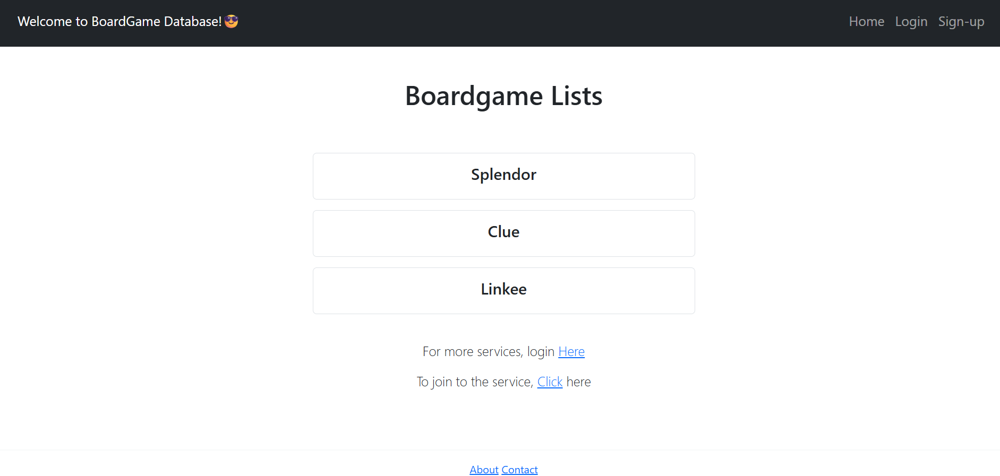
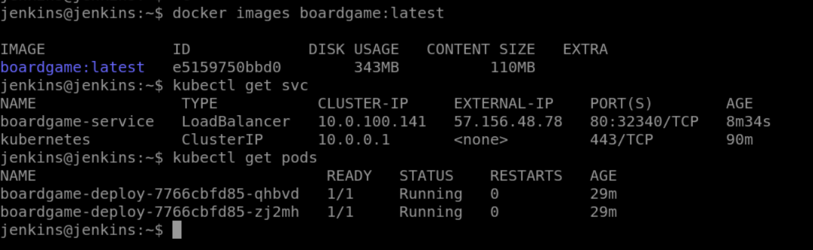
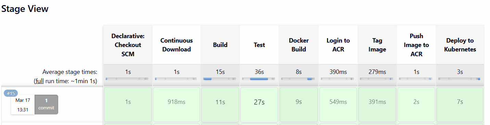

# 🎲 Boardgame Application

This is a simple web application that shows a list of popular board games.  
I built this project to understand how a real DevOps workflow works from start to end.

---

##  Overview

In this project, I focused on how an application moves through different stages like build, containerization, and deployment.

### What I did in this project:
- Built a backend application using Spring Boot  
- Created a Docker image for the application  
- Set up a Jenkins pipeline for automation  
- Used Kubernetes YAML files for deployment  

---

##  Tech Stack

- Java / Spring Boot  
- Maven  
- Docker  
- Jenkins  
- Git & GitHub  
- Kubernetes (YAML)  

---

##  Docker Setup

  docker build -t boardgame-app .
  
### Build the image

docker run -p 8080:8080 boardgame-app

---

##  CI/CD Pipeline

I used Jenkins to automate the process:

- Build the project using Maven  
- Create a Docker image  
- Deploy the application  

The pipeline is defined in the `Jenkinsfile`.

---

📸 Screenshots
Application Running

Docker Execution

Jenkins Pipeline

---

##  What I Learned

- How Docker works in real projects  
- Basics of Jenkins CI/CD  
- Writing Kubernetes YAML files  
- Understanding complete DevOps workflow  

---

## 📂 Project Structure
